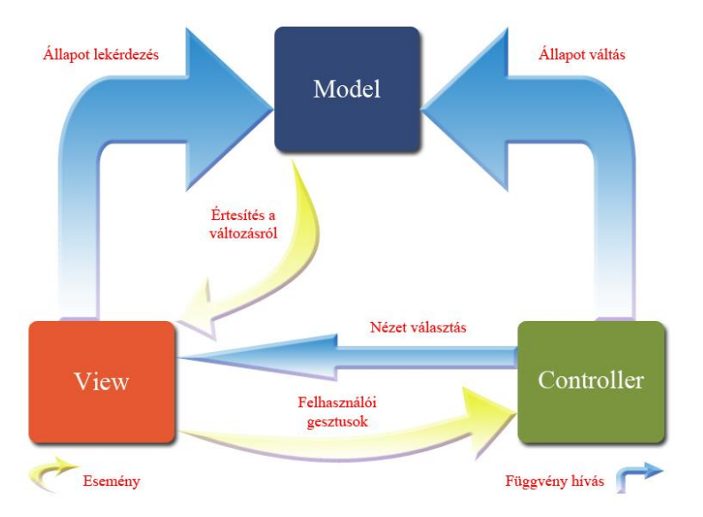

# Rendszerterv

## 1. A rendszer célja

A rendszer célja egy modern, felhasználóbarát online éttermi rendelőplatform létrehozása, amely lehetővé teszi a felhasználók számára az ételek böngészését, kiválasztását és online történő megrendelését.  
A rendszer támogatja az étterem dolgozóit is azáltal, hogy egyszerű és átlátható felületen kezelhetik a rendeléseket, az ételeket és a rendelés státuszokat.

### Amit a rendszer meg akar oldani

- Teljesen online rendelési folyamat biztosítása: regisztráció, bejelentkezés, kosárkezelés, rendelés leadása.
- Adminisztrációs felület biztosítása az étterem számára: rendelés kezelés, ételek szerkesztése, státuszfrissítés.
- AI alapú chatbot integrálása a felhasználói élmény javítására: ajánlások, gyakori kérdések megválaszolása.
- Valós idejű rendeléskövetés a felhasználók számára.

### Amit a rendszer **nem** csinál

- Nem kezeli offline rendeléseket (telefonon vagy személyesen leadott rendeléseket).
- Nem biztosít fizikai szállítási logisztikát vagy készletkezelést az étterem részére.
- Nem helyettesíti a teljes éttermi ügyviteli rendszert (pl. könyvelés, munkaidő-nyilvántartás).

## 2. Projekt terv

### 2.1. Projektszerepkörök, felelősségek

| Szerepkör                     | Felelősség                                                                       |
| ----------------------------- | -------------------------------------------------------------------------------- |
| Frontend UI/UX fejlesztő      | HTML és CSS alapú felhasználói felületek tervezése és implementálása             |
| Frontend JavaScript fejlesztő | JavaScript alapú interaktív funkciók fejlesztése, API hívások kezelése           |
| Backend fejlesztő             | Szerveroldali logika, API-k, adatfeldolgozás és üzleti logika megvalósítása      |
| Adatbázis fejlesztő           | Adatbázis tervezése, táblák létrehozása, kapcsolatok és lekérdezések biztosítása |

### 2.2. Projektmunkások és felelősségeik

| Név             | Szerepkör         | Főbb feladatok                                                              |
| --------------- | ----------------- | --------------------------------------------------------------------------- |
| Kondor Kristóf  | Frontend UI       | Felhasználói felület HTML/CSS tervezése és implementációja                  |
| Nyiri László    | Frontend JS       | Kosárkezelés, rendelés leadás, interaktív UI elemek, AI chatbot integráció  |
| Sebestyén Bence | Backend fejlesztő | API-k készítése, rendeléskezelés, felhasználói autentikáció, backend logika |
| Kacsó Melinda   | Adatbázis         | Adatbázis struktúra, táblák létrehozása, SQL lekérdezések, adatbiztonság    |

## 3. Üzleti folyamatok modellje

### 3.1. Üzleti szereplők

| Szereplő                             | Leírás                                                                                    | Fő cél                                                          |
| ------------------------------------ | ----------------------------------------------------------------------------------------- | --------------------------------------------------------------- |
| **Felhasználó (vásárló)**            | Regisztrált vagy vendégként böngésző látogató, aki ételeket keres és rendel.              | Ételek kiválasztása és online rendelés leadása.                 |
| **Adminisztrátor / Étterem dolgozó** | Az étterem munkatársa, aki az online rendeléseket kezeli.                                 | Rendelések megtekintése, státuszfrissítés, étlap karbantartása. |
| **Rendszer (backend)**               | A központi szerver és adatbázis, amely a rendeléseket, felhasználókat és ételeket kezeli. | Adatok tárolása, API biztosítása, logika működtetése.           |

---

### 3.2. Üzleti folyamatok

| Folyamat                             | Leírás                                                                                                        | Szereplők                | Eredmény                                    |
| ------------------------------------ | ------------------------------------------------------------------------------------------------------------- | ------------------------ | ------------------------------------------- |
| **Regisztráció / Bejelentkezés**     | A felhasználó fiókot hoz létre, vagy meglévő adataival bejelentkezik.                                         | Felhasználó, Rendszer    | Személyes fiók létrejön vagy aktívvá válik. |
| **Étlap böngészése**                 | A felhasználó áttekinti a kínálatot, szűrhet és kereshet.                                                     | Felhasználó, Rendszer    | A felhasználó megtalálja a kívánt ételeket. |
| **Kosárkezelés és rendelés leadása** | A felhasználó kosárba teszi az ételeket, majd leadja a rendelést.                                             | Felhasználó, Rendszer    | Új rendelés rögzítve az adatbázisban.       |
| **Rendelés feldolgozása**            | Az adminisztrátor látja az új rendelést, és frissíti annak státuszát (pl. „Elkészítés alatt”, „Kiszállítva”). | Adminisztrátor, Rendszer | A rendelés státusza frissül.                |
| **Rendeléskövetés**                  | A felhasználó valós időben látja a rendelés aktuális állapotát.                                               | Felhasználó, Rendszer    | Felhasználó értesül a státuszváltozásról.   |

---

### 3.3. Üzleti entitások

| Entitás            | Leírás                                             | Fő attribútumok                                     |
| ------------------ | -------------------------------------------------- | --------------------------------------------------- |
| **Felhasználó**    | Az alkalmazás regisztrált használója.              | felhasználó_id, név, email, jelszó, cím             |
| **Étel**           | Az étterem által kínált termék.                    | étel_id, név, leírás, ár, kategória, kép_url        |
| **Rendelés**       | Egy felhasználó által leadott rendelés.            | rendelés_id, felhasználó_id, dátum, összeg, státusz |
| **Rendelés_tétel** | Egy rendeléshez tartozó konkrét étel és mennyiség. | rendelés_tétel_id, rendelés_id, étel_id, mennyiség  |

## 4. Követelmények

### 4.1. Funkcionális követelmények

A rendszer funkcionális követelményei azokra a működési képességekre vonatkoznak, amelyeket a felhasználók közvetlenül érzékelnek vagy használnak.

| Azonosító | Követelmény                       | Leírás                                                                                             |
| --------- | --------------------------------- | -------------------------------------------------------------------------------------------------- |
| F1        | **Regisztráció és bejelentkezés** | A felhasználó létrehozhat fiókot vagy bejelentkezhet meglévő adataival.                            |
| F2        | **Felhasználói adatok kezelése**  | A felhasználó módosíthatja profiladatait (név, cím, jelszó).                                       |
| F3        | **Étlap böngészése**              | A rendszer megjeleníti az étterem aktuális kínálatát kategóriák szerint.                           |
| F4        | **Keresés és szűrés**             | A felhasználó név, ár vagy kategória alapján kereshet az ételek között.                            |
| F5        | **Kosárkezelés**                  | A felhasználó hozzáadhat, eltávolíthat vagy módosíthat tételeket a kosárban.                       |
| F6        | **Rendelés leadása**              | A felhasználó megerősítheti a kosár tartalmát, és rendelést adhat le.                              |
| F7        | **Rendelés státusz megtekintése** | A felhasználó valós időben láthatja a rendelése állapotát.                                         |
| F8        | **Adminisztrációs felület**       | Az étterem dolgozói új ételeket vehetnek fel, rendeléseket kezelhetnek, státuszokat frissíthetnek. |

---

### 4.2. Nemfunkcionális követelmények

Ezek a követelmények a rendszer **minőségi jellemzőit** határozzák meg: teljesítmény, biztonság, használhatóság stb.

| Azonosító | Követelmény           | Leírás                                                                             |
| --------- | --------------------- | ---------------------------------------------------------------------------------- |
| N1        | **Használhatóság**    | A felhasználói felület legyen intuitív, reszponzív és könnyen kezelhető.           |
| N2        | **Megbízhatóság**     | A rendszer képes legyen hibatűrő működésre és adatvesztés elkerülésére.            |
| N3        | **Teljesítmény**      | A rendszer átlagos válaszideje ne haladja meg az 1 másodpercet API-hívások esetén. |
| N4        | **Biztonság**         | Az adatok titkosítva legyenek (pl. jelszavak hash-elése, HTTPS kapcsolat).         |
| N5        | **Skálázhatóság**     | A rendszer képes legyen több felhasználót kiszolgálni párhuzamosan.                |
| N6        | **Karbantarthatóság** | A kód legyen moduláris, jól dokumentált, könnyen bővíthető.                        |
| N7        | **Kompatibilitás**    | A rendszer működjön modern böngészőkön (Chrome, Firefox, Edge, Safari).            |
| N8        | **Elérhetőség**       | A rendszer legalább 99% rendelkezésre állással működjön.                           |

---

## 5. Funkcionális terv

### 5.1. Rendszerszereplők

| Szereplő                             | Leírás                                                                      | Jogosultságok                                                                 |
| ------------------------------------ | --------------------------------------------------------------------------- | ----------------------------------------------------------------------------- |
| **Felhasználó**                      | A rendszer végfelhasználója, aki böngészi az étlapot és rendeléseket ad le. | Rendelés leadása, rendelés megtekintése, profiladatok módosítása.             |
| **Adminisztrátor (étterem dolgozó)** | Az étterem munkatársa, aki az online rendeléseket és az étlapot kezeli.     | Rendelés státusz módosítása, új étel hozzáadása, ételek szerkesztése/törlése. |
| **Rendszer**                         | A háttérrendszer, amely az adatokat kezeli és a logikai folyamatokat végzi. | API hívások kezelése, adatbázis műveletek, jogosultság ellenőrzés.            |
| **AI Chatbot**                       | Automatizált asszisztens, amely támogatja a felhasználót.                   | Ajánlások adása, kérdések megválaszolása, információk lekérése.               |

---

### 5.2. Rendszerhasználati esetek

#### F1 – Regisztráció és bejelentkezés

- **Szereplő:** Felhasználó
- **Előfeltétel:** A felhasználó még nem regisztrált / nincs bejelentkezve.
- **Lefutás:**
  1. A felhasználó megadja az adatait (név, email, jelszó).
  2. A rendszer ellenőrzi az email-címet.
  3. Sikeres regisztráció után a felhasználó bejelentkezik.
- **Utófeltétel:** A felhasználó fiókja aktív.

#### F2 – Étlap böngészése és keresés

- **Szereplő:** Felhasználó
- **Előfeltétel:** A rendszer elérhető és az étlap betöltött.
- **Lefutás:**
  1. A felhasználó kategóriák szerint böngészi az ételeket.
  2. Keresést vagy szűrést végez (pl. ár, név, kategória).
- **Utófeltétel:** A felhasználó kiválaszthat egy ételt a rendeléshez.

#### F3 – Kosárkezelés és rendelés leadása

- **Szereplő:** Felhasználó
- **Lefutás:**
  1. A felhasználó kosárba helyezi a kiválasztott ételeket.
  2. Ellenőrzi a kosár tartalmát és megerősíti a rendelést.
  3. A rendszer elmenti a rendelést az adatbázisba és visszaigazolja.
- **Utófeltétel:** A rendelés rögzítve és feldolgozás alatt.

#### F4 – Rendelés státusz kezelése

- **Szereplő:** Adminisztrátor
- **Lefutás:**
  1. Az adminisztrátor megnyitja a rendeléskezelő panelt.
  2. Kiválaszt egy rendelést és módosítja a státuszát.
  3. A rendszer frissíti az adatbázist, és értesíti a felhasználót.
- **Utófeltétel:** A rendelés státusza naprakész.

---

### 5.3. Határosztályok

| Osztály                         | Leírás                                                                                |
| ------------------------------- | ------------------------------------------------------------------------------------- |
| **Felhasználói felület (UI)**   | Kliensoldali HTML/CSS/JS réteg, ahol a felhasználó interakcióba lép a rendszerrel.    |
| **Alkalmazáslogika (Backend)**  | API végpontok és üzleti logika megvalósítása szerveroldalon (pl. Flask/Spring).       |
| **Adatkezelő réteg (Database)** | Az adatbázis, amely az ételeket, felhasználókat, rendeléseket és státuszokat tárolja. |

---

### 5.4. Menü-hierarchiák

### 5.5. Képernyőtervek

## 6. Fizikai környezet

### 6.1. Vásárolt szoftverkomponensek és külső rendszerek

A rendszer az **AlwaysData** szolgáltatás által biztosított **MySQL adatbázist** használja,  
amelyhez a hozzáférést a beépített **phpMyAdmin** felület biztosítja.  
Ez lehetővé teszi az adatok biztonságos kezelését, valamint a táblák karbantartását és felügyeletét böngészőből.

Továbbá a rendszer az **OpenAI API**-t is integrálja, amely egy **AI chatbot** funkciót valósít meg.
Ez a komponens a felhasználói kérdések megválaszolását és az ajánlások dinamikus generálását teszi lehetővé, ezáltal javítva a felhasználói élményt és az interaktivitást.

### 6.2. Hardver és hálózati topológia

A fejlesztés és tesztelés **lokális fejlesztői környezetben** történik, amely lehetővé teszi a gyors iterációt és a hibák korai felismerését.

A rendszer a **kliens–szerver architektúrát** követi: a Flask alapú backend alkalmazás a fejlesztői gépen fut, miközben a **MySQL adatbázis** az **AlwaysData** szerverein kerül tárolásra és futtatásra.

### 6.3. Fizikai alrendszerek

### 6.4. Fejlesztő eszközök

A projekt fejlesztése a következő eszközökkel történik:

| Eszköz                    | Leírás                                  |
| ------------------------- | --------------------------------------- |
| **Visual Studio Code**    | Forráskód-szerkesztés és projektkezelés |
| **Git + GitHub**          | Verziókövetés és csapatmunka            |
| **Postman**               | API végpontok tesztelése                |
| **phpMyAdmin**            | MySQL adatbázis kezelése                |
| **Python**                | Backend fejlesztés                      |
| **Flask**                 | Webszerver és REST API keretrendszer    |
| **HTML, CSS, JavaScript** | Frontend fejlesztés                     |

### 6.5. Keretrendszer (pl. Spring)

Flask

## 7. Absztrakt domain modell

### 7.1. Domain specifikáció, fogalmak

### 7.2. Absztrakt komponensek, ezek kapcsolatai

## 8. Architekturális terv

### 8.1. Architekturális tervezési minta

A rendszer architektúrája az `MVC` (Model - View - Controller) mintát követi.

### 8.2. Az alkalmazás rétegei, fő komponensei, ezek kapcsolatai

- **Model (adatkezelés):**  
  Az adatbázisban tárolt entitások (felhasználók, ételek, rendelések) leképezése Python osztályok segítségével.
  A Model réteg felelős az adatok konzisztenciájáért és az üzleti logikai szabályok betartásáért.

- **View (megjelenítés):**  
  A felhasználóval történő interakciót biztosítja HTML, CSS és JavaScript segítségével.  
  A cél egy **reszponzív, könnyen kezelhető és gyors felület** kialakítása (nemfunkcionális követelmény: N1 – Használhatóság).

- **Controller (irányítás):**  
  A Flask útvonalak (`@app.route`) fogadják a felhasználói kéréseket, feldolgozzák azokat, majd a megfelelő modellekhez és nézetekhez irányítják az adatokat.  
  Biztosítja a **logikai folyamatok elkülönítését** és az **adatbiztonságot** (N4 – Biztonság).

### 8.3. Változások kezelése

A rendszer célja, hogy a fejlesztés és későbbi módosítás során is **rugalmasan kezelje a változásokat**, anélkül, hogy a teljes alkalmazást újra kellene szervezni.

- **Követelmények és függőségek kezelése:**  
  A projektben egy `requirements.txt` fájl tartalmazza az összes Python függőséget.  
  Így a környezet bármikor egyszerűen újraépíthető (`pip install -r requirements.txt`).

- **Moduláris kódstruktúra:**  
  A kód külön fájlokba van szervezve (`app.py`, `templates/` stb.), így egy-egy funkció (pl. kosárkezelés, rendeléslogika) módosítása nem érinti a teljes rendszert.

- **Egyszerű konfigurálhatóság:**  
  Az alapvető beállítások (adatbázis, debug mód) közvetlenül az `app.py` fájlban találhatók, így könnyen módosíthatók fejlesztés közben.

- **Git verziókezelés:**  
  A forráskód verziókezelése biztosítja a módosítások nyomon követését.

Ezek a megoldások biztosítják, hogy a rendszer **könnyen frissíthető és karbantartható** maradjon, megfelelve a **N6 – Karbantarthatóság** követelménynek.

### 8.4. Rendszer bővíthetősége

A rendszer **moduláris felépítésének** köszönhetően könnyen bővíthető:

- **Új funkciók hozzáadása:**  
  Például új rendelési státusz („Úton van”), hűségpont rendszer vagy fizetési modul egyszerűen integrálható új route és model hozzáadásával.
- **Adatbázis bővítése:**  
  Új táblák (pl. értékelések, kedvenc ételek) felvétele lehetséges a meglévő kapcsolatok megtartása mellett.

- **Frontend bővítése:**  
  Az új funkciókhoz könnyen hozzáadhatók új oldalak vagy felhasználói felületi elemek.  
  A HTML sablonok és a statikus fájlok (CSS, JavaScript) külön mappákban találhatók, így a kinézet vagy a navigáció módosítása nem érinti az alkalmazás logikáját.

Ez biztosítja a **rendszer jövőbeli fejleszthetőségét és rugalmasságát**, megfelelve a **karbantarthatósági (N6)** és **skálázhatósági (N5)** követelményeknek.

### 8.5. Biztonsági funkciók

- **Felhasználói autentikáció és jogosultságkezelés:**
  - Regisztrált felhasználók csak a saját profiljukat és rendeléseiket láthatják.
  - Admin jogosultság szükséges az étlap és rendelésstátusz kezeléséhez.
- **Adatbiztonság:**
  - Jelszavak hash-elve kerülnek tárolásra az adatbázisban.
- **Input validálás:**
  - Az űrlapadatokat a backend oldalon ellenőrzi a rendszer a hibás vagy rosszindulatú adatok kiszűrése érdekében.

Ezek a megoldások kielégítik az N2 (**Megbízhatóság**) és N4 (**Biztonság**) nemfunkcionális követelményeket.

## 9. Adatbázis terv

### 9.1. Logikai adatmodell

### 9.2. Tárolt eljárások

### 9.3. Fizikai adatmodellt legeneráló SQL szkript

## 10. Implementációs terv

### 10.1. Perzisztencia-osztályok

### 10.2. Üzleti logika osztályai

### 10.3. Kliensoldal osztályai

## 11. Tesztterv

## 12. Telepítési terv

## 13. Karbantartási terv
